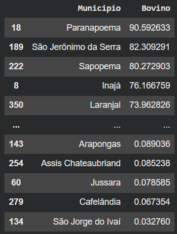
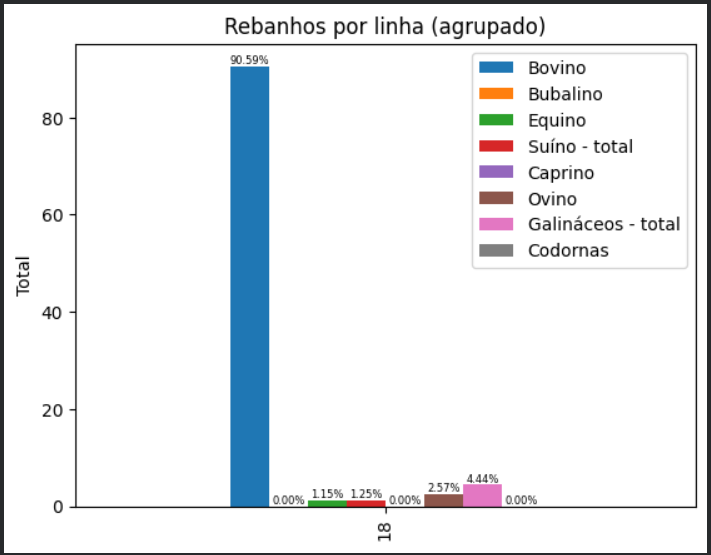

# Analise da producao pecuaria no Paraná
Este repositório conta com uma análise via Python dos dados públicos do IBGE da produção pecuária nas cidades do Paraná.

## Objetivo
Está análise tem como objetivo entender a distribuição da produção pecuária nas cidades do Paraná e descobrir algumas informações interessantes com base nos dados públicos do IBGE

## Dados
Fonte: IBGE (2023) acesse [aqui](https://www.ibge.gov.br/en/statistics/economic/agriculture-forestry-and-fishing/17353-municipal-livestock-production.html?=&t=o-que-e)

Notebook com o código: [aqui](https://github.com/dimatteofb/analise_da_producao_pecuaria_no_parana/blob/main/livestock.ipynb)

## Metodologia (resumida)
1. Leitura dos dados brutos (Excel/CSV).  
2. Limpeza: remoção de rodapés/linhas não-dados, tratamento de `'-'` e conversão para numérico.  
3. Cálculo dos percentuais internos por município
4. Geração das imagens com os resultados

## Limitações e desafios
- Os dados do IBGE estavam formatados com espaços para separar regiões de municípios, a análise não abortou esta questão diretamente, mas seria necessário formatar os dados pensando nisso para uma análise mais aprofundada.
- Além disso, existiam linhas com informações não pertinentes aos dados brutos no meio dos dados e o cabeçalho não estava pronto para análise.

## Perguntas respondidas
- Qual o município com mais criação de bovinos em relação às outras categorias.
- Qual a distribuição das criações deste município.

## Resultados
- A partir da análise, foi constatado que a cidade com mais criação de bovinos em relação ás outras categorias foi Paranapoema:

- A distribuição das criações deste municipio foi a seguinte:

